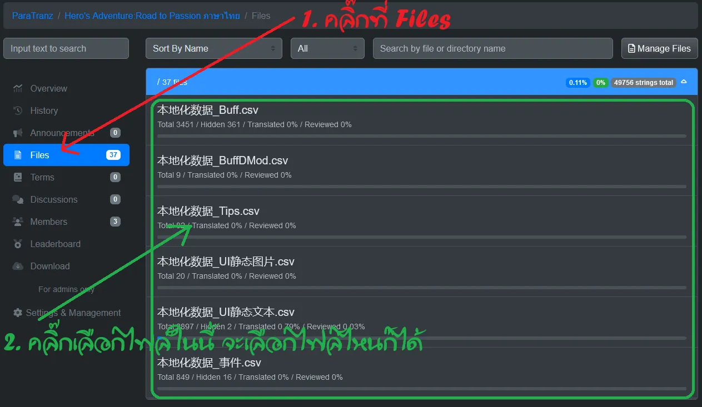
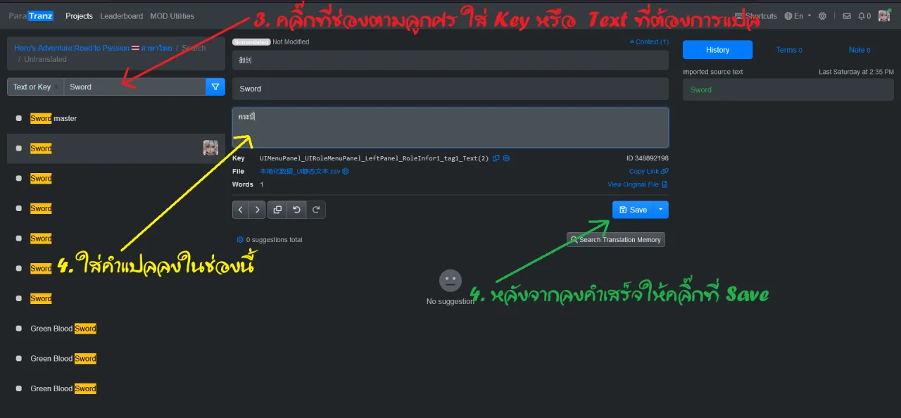
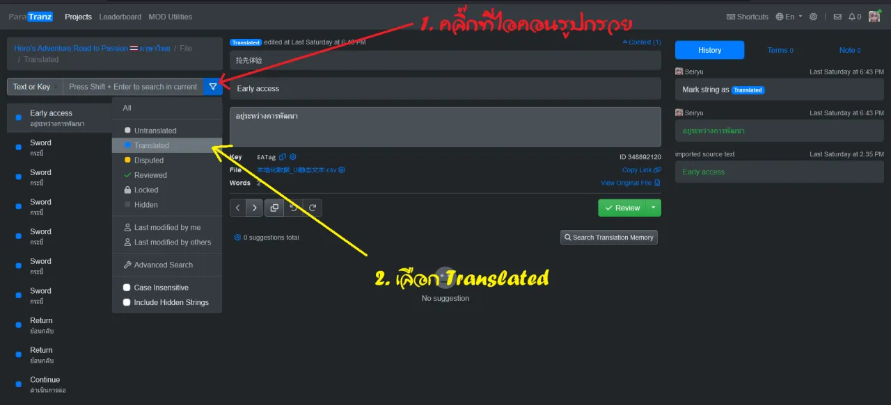

# Hero's Adventure:Road to Passion ภาษาไทย 
ม็อดแปลเกม Hero's Adventure:Road to Passion ภาษาไทย

  

# วิธีติดตั้ง
- ดาวน์โหลด [BepInEx Bleeding Edge](https://builds.bepinex.dev/projects/bepinex_be)

 

- ดาวน์โหลดตัวม็อดจาก  และนำไปแตกไฟล์ในโฟลเดอร์เกม 

 

- ไปยังไดเรกทอรีที่วงไว้ โฟลเดอร์เกม BepInEx\plugins\Seiryu.Wulin.NET6\Translations แล้วดับเบิ้ลคลิ๊กที่ไฟล์ update_localization.bat 

 

- รอ รอ รอ... อัพเดทคำแปล เสร็จแล้วก็เข้าเกมตามปกติ ซึ่งการเข้าเกมหลังจากที่เคยลง BepInEx ครั้งแรกจะใช้เวลานานสักพักนึง

 

- ท๊าดา~ 

 

# เปิดให้ช่วยแปล
- [ลิงค์โปรเจคแปลใน ParaTranz](https://paratranz.cn/projects/8405) ถ้าใครสนใจอยากจะแปลก็ขอเชิญแวะไปแปลใน ParaTranz ได้เลยนะครับ บอทจะดึงคำแปลจาก paratranz ราวๆเที่ยง และราวๆ 2 ทุ่มของทุกวัน ให้ไปเช็คเปอร์เซ็นความคืบของการแปลในโปรเจค paratranz กันเอาเอง แล้วค่อยมา กด update_localization.bat ตามขั้นตอนรูปด้านบนเพื่ออัพเดทคำแปล 

# การใช้งาน Paratranz เบื้องต้น
- ถ้าเพิ่งเคยเข้าเว็บ ParaTranz เป็นครั้งแรกแล้วเป็นภาษาจีนให้คลิ๊กตามลูกศรเพื่อเปลี่ยนเป็นภาษาอังกฤษ

 

 

 

- วิธีเช็คดูคำที่แปลไปแล้ว

 

- เนื่องจาก Paratranz ไม่มีฟีเจอร์ translate ช่วย เลยแนะนำให้ไปลง Add-Ons พวก Quickly translate อย่าง Google แปลภาษา หรือ Simple Translate กันเอาเองนะ (ส่วนตัวผมใช้ Simple Translate อยู่)

 

# Disclaimer
- ม็อดตัวนี้ใช้ BepInEx Bleeding Edge 6.0.0-be.674+82077ec ขึ้นไป เพราะงั้นอาจจะไม่สามารถทำงานกับ XUnity.AutoTranslator (ออโต้กูเกิ้ลแปล) เวอร์ชั่นปัจจุบันได้ ถ้าใครจะลงม็อดตัวนี้ควรลบ BepInEx เวอร์ชั่นเก่าที่เคยลงมาออกก่อน (ให้ชัวร์ลบเกมแล้วลงใหม่เลย) หรือถ้าจะลง XUnity.AutoTranslator ก็ต้องลบม็อดตัวนี้ออกด้วยเช่นกัน

# Credits
- ZeSS.FontOverride.BepInEx6.IL2CPP
